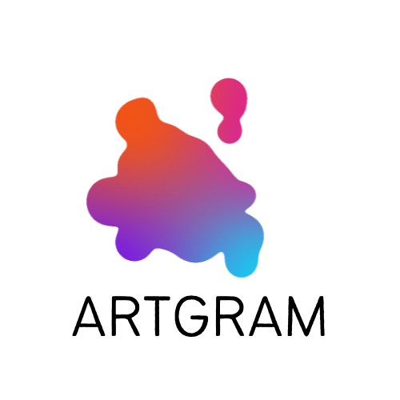

#  ARTGRAM

<div align="center">
  <a href="https://github.com/Openbank-Java-Bootcamp/Luci-Artgram-Client">
    
  </a>
</div>

## Description
Artgram is a social network where artists can exhibit their works.
You can upload, edit and delete your paintings. Also, you can see another artists paintings and like and comment their works.

## Set Up
1. Clone or download the project from the repository.
2. Open the directory on Visual Studio Code.
3. Install packages and dependencies:

```
npm install
```
4. Run the application:

```
npm start
```
5. Follow the instructions in the other Repository: Luci-Artgram-Server.

## Techonologies Used
SPA Frontend with React, Javascript, Bootstrap, Axios, React-router-dom.

## Components and Pages structure

1. Components: 
  - ADD COMMENT.
  - COMMENT CARD.
  - HEADER.
  - FOOTER.
  - IS ANON.
  - IS PRIVATE.
  - LIKE BUTTON.
  - PAINTING CARD.
3. Pages structure:
  - Welcome Page.
  - Sign up Page.
  - Login Page.
  - Gallery Page.
  - Profile Page.
  - Painting Details Page.
  - Add Painting Page.
  - Edit Painting Page.

## Demo
  
  
  
  
  
  

## Future Work
- Improve security system
- Improve Likes
- Improve Comments
- Add search Bar
- Add Edit Profile
- Add Save Paintings from another artists
- Notifications(Likes and Comments)

## Resources
- React Bootstrap: https://react-bootstrap.github.io/
- React Documentation: https://reactjs.org/
- Create React App: https://create-react-app.dev/
- React Props: https://www.agiliq.com/blog/2018/05/understanding-react-state-and-props/#understanding-reactjs-props
- Hooks: https://reactjs.org/docs/hooks-reference.html
- MDN: https://developer.mozilla.org/en-US/
- Color picker: https://www.google.com/search?q=color+picker&oq=color+pi&aqs=chrome.0.0i131i433i512j69i57j0i433i512j0i512j0i433i512j0i512l5.3522j0j7&sourceid=chrome&ie=UTF-8
- TRELLO: https://trello.com/invite/b/K1vCHyTb/ca6aa87b33ae20109fd897f770b06a79/artgram
- CSS selectors: https://developer.mozilla.org/en-US/docs/Web/CSS/Pseudo-classes
- Ironhack Student Portal
- Inspo: https://www.instagram.com/
- Inspo: https://www.frieze.com/
- Inspo and pictures: https://theposterclub.com/
- And Raymond and Shaun: thank you for your support these crazy 9 weeks!
